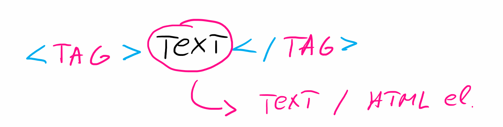
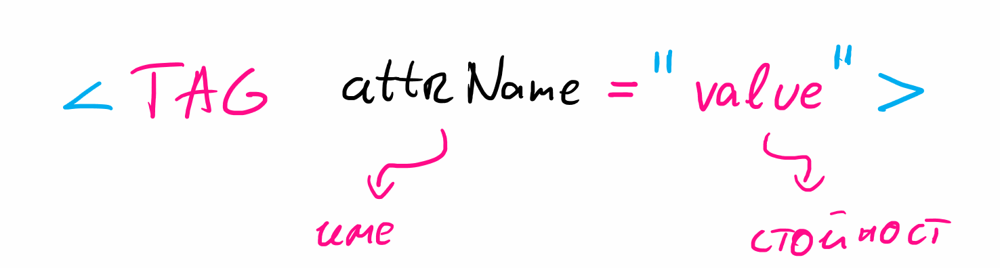

# Среща 1 - Въведение в WEB - HTML документи

#### 💡 - Какво разгледахме днес
- Как работи браузъра;
- XML / HTML и за какво ни трябва;
- Базови HTML елементи;
- Работа с HTML елементи в контекста на тестови сценарии.

 #### 📚 - Ресурси и материали
- [Видео от срещата](https://www.youtube.com/watch?v=5Rv3lKzygho&list=PLyZOguednhL5s3LH63o1q8CHhfNk4kvf1&index=2)
- [Сорс код от срещата](./source/)

 #### 🕹️ - Задачи за упражнения
- [Работа в час](./cw/README.md)
- [Домашна работа](./hw/README.md)


### **Понятия в XML**

Основната структура на единична HTML инструкция е представена на графиката.


Ще вкараме малко терминология:
- **таг** наричаме специален HTML символ - таговете винаги се дефинират със специалните символи (отваряща) и (затваряща) ъглова скоба. Таговете биват **отварящи** и **затварящи**.
- **елемент** - двойка отварящ и затварящ таг
- **съдържание** - това което се намира в рамките на елемента.

Допълнително всеки един от елементите може да добави допълнителни характеристики, които наричаме атрибути. Част от атрибутите са предварително дефинирани, но има и механизми чрез които може да сефинираме собствени такива



### **Базови HTML елевенти**

Един HTML документ се състои от две категории тагове:
- административни
- структурни

**Административните** - описват документа от гледна точка на неговата валидност. Те съществуват за да могат да валидират пред браузъра, че този документ може да се ползва адекватно от системите, които го интересуват.
**Структурните** - са типичния фокус на разработчиците, те описват съдържанието и дават необходимите етикети, които да ползваме като програмисти за да адресираме всеки един от тези елементи.


### **Създаване на базов HTML документ**
Необходими са ни 3 административни елемента за да опишем един валиден документ
```html
<html>
    <head></head>
    <body></body>
</html>
```

Елемента **HTML**, подсказва на заинтересованите машиини че това е хипертекстов документ. В страни от тази достойнна за него функция, няма друга ползва. Малко но от сърце. Останалите два административни тага описват съответно:
- **head** - описва особеностите на документа, като заглавие, език, външни ресурси. Тоест все аспекти които потребителя няма да види, но са важни за машината която го интерпретира. 
- **body** - описва структурата на документа. В рамките на този елемент се разписва цялата информация, която ще се визуализира на крайния потребител. Информацията описана в този елемент, съдържа всички структурни елементи, за които ще говорим. 

### **Основни HTML елементи**
Ще разгледаме няколко основни HTML елемента, които идентифицират специфична информация в HTML документ
- h1, h2, h3, h4, h5, h6 - описва важна информация за документ - основно заглавия
- div   - описва блок с информация, без особени специфики
- span  - описва блок с информация, без особени специфики
- img   - описва медиино съдържание тип изображение

### **Работа с атрибути**
Тагове често не са достатъчни. Какво виждате нямаме огромно разнообразие. В страни от основните заглавия в един документ, няма как да различаваме всички **div** или **span** или **img** елементи лесно. Затова в HTML съществуват, атрибути, които да ни дадът малко по подробна информация за тяхното название:
- id - уникален идентификатор
- class - идентификатор за група от елементи
