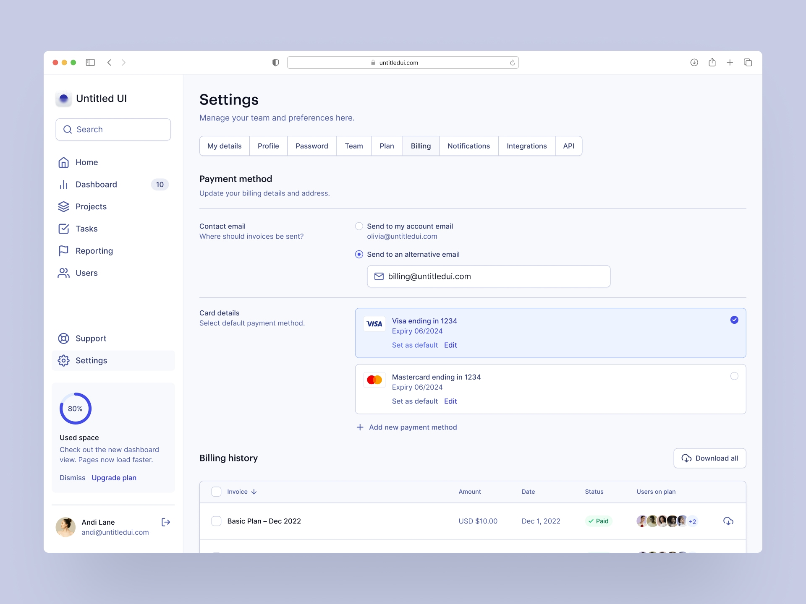

# HTML структура

Разполагате с  концептуален дизайн. Състоящ се от следните 4 елемента:
- header
- странична лента (информация за потребителя)
- осново съдържание
- втора странична лента (набор от активности)

Създайте HTML структура която:
- съдържа валиден HTML документ
- подбира коректно (по ваша преценка), елементите за съдържанието