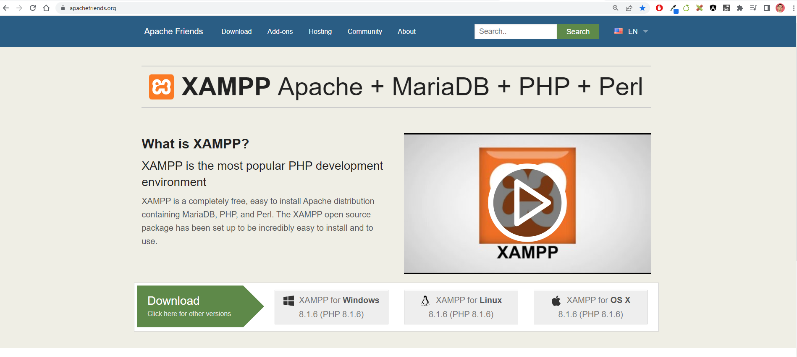
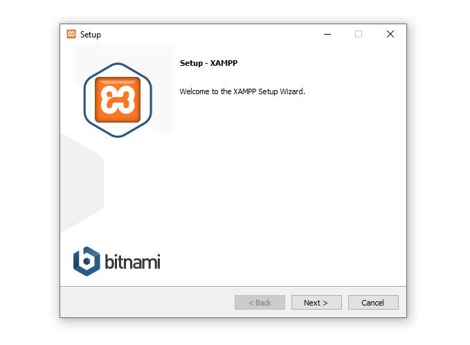
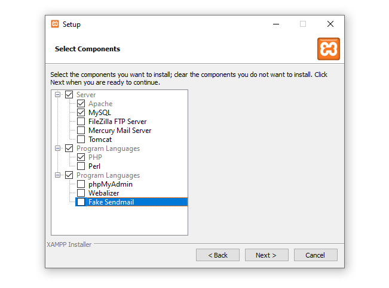
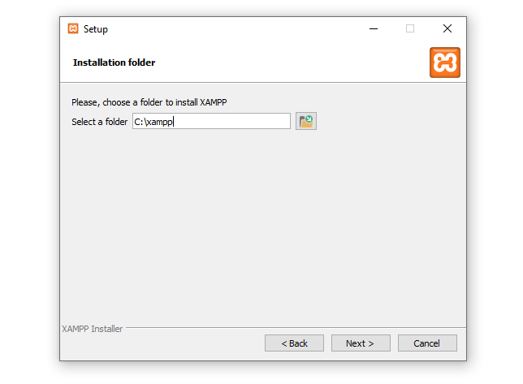
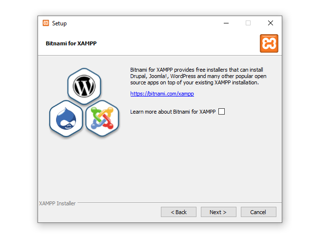
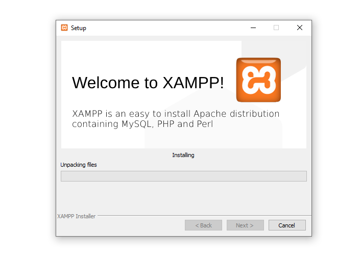
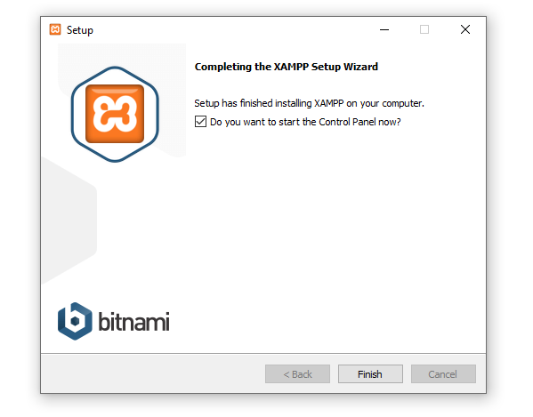
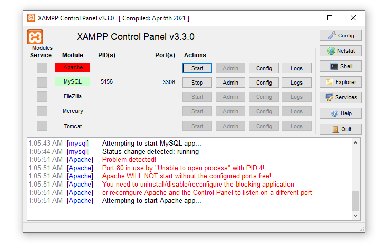

# Среща 13 - Инструменти за функционално тестване на UI компоненти - част 1

#### 💡 - Какво разгледахме днес
- какво представлява мрежата и сървърите
- особености при тестване на потребителски интерфейс
- защо не ползваме просто Java Script проблеми и решения
- представяне на Selenim IDE и неговите възможности

#### 📚 - Ресурси и материали
- [Сорс код от срещата](./source/)

### Как се инсталира XAMP

Програмата можете да намерите [ТОЗИ адрес](https://www.apachefriends.org/), идзберете подходяща версия, в зависимост от операционната ви система.

Нека разгледаме последователно стъпките, по инсталацията на продукта, подобно на всички Windows базирани инсталатори, смело натискайте Next и се понесете по вълните на инсталацията.

Необходимо ни е да инсталираме само малка част от предоставените ни продукти:
- Apache - това е web сървъра, който ще бъде отговорен за обработката на заявките, към локалните WEB приложения, които ще тестваме. 
- MySQL - това е базата данни, в която ще съхраняваме информацията, която ще тестваме
- PHP - интерпретатор за езика за програмиране PHP, на който е написано приложението Wordpress около което ще консолидираме, нашата инсталация.

Всички остали, продукти са напълно излишни в контекста, на нашите активности, така че можете спокойно да ги махнете от списъка. 

Изберете дестинацията предоставена по подразбиране. Няма нужда от креативност, нека да се придържаме към стандартите. 

За съжаление езиковото разнообразие в програмата е доста ограничено, имам непреодолима необходимост да чета на Японски и Арабски, но за съжаление разработчиците са неграмотни и не са ни дали тази възможност. Ами избираме англииски и страдаме тихичко.

Тук изненади няма, продължаваме напред, както е казал Кобрата.

Чакаме, чакаме, чакаме и така нататък, докато в един момент всичко ще приключи, по груби сметки 5 / 7 минути.

След успешно инсталиране, ще бъдете подканени да стартирате приложението - така наречения **контролен панел**. Ако изберете да не се съобразите - можете да намерите приложението с название **XAMP**

Контролния панел, ни дава възможност да управляваме програмите които ни трябват. Ще разберем подробности, за това - как да работим с тях доста скоро. 

